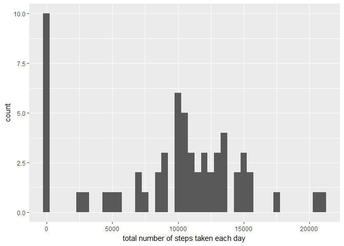
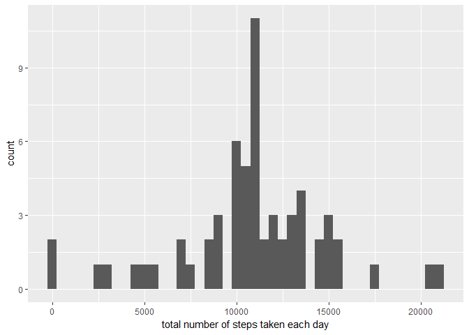

Course Project 1
================
June 9, 2017

Reproducible Research: Peer Assessment 1
----------------------------------------

``` r
library(ggplot2)
library(scales)
library(Hmisc)
```

    ## Warning: package 'Hmisc' was built under R version 3.4.1

    ## Loading required package: lattice

    ## Loading required package: survival

    ## Loading required package: Formula

    ## 
    ## Attaching package: 'Hmisc'

    ## The following objects are masked from 'package:base':
    ## 
    ##     format.pval, round.POSIXt, trunc.POSIXt, units

``` r
library(chron)
```

    ## Warning: package 'chron' was built under R version 3.4.1

Loading and preprocessing the data
----------------------------------

1.  Load the data (i.e. read.csv())

Process the data:
-----------------

``` r
total.steps <- tapply(data$steps, data$date, FUN=sum, na.rm=TRUE)
```

What is mean total number of steps taken per day?
-------------------------------------------------

1.  Make a histogram of the total number of steps taken each day

``` r
library(ggplot2)
qplot(total.steps, binwidth=500, xlab="total number of steps taken each day")
```



1.  Calculate and report the mean and median total number of steps taken per day

``` r
mean(total.steps, na.rm=TRUE)
```

    ## [1] 9354.23

``` r
median(total.steps, na.rm=TRUE)
```

    ## [1] 10395

What is the average daily activity pattern?
-------------------------------------------

1.  Make a time series plot

``` r
library(ggplot2)
averages <- aggregate(x=list(steps=data$steps), by=list(interval=data$interval),
                      FUN=mean, na.rm=TRUE)
ggplot(data=averages, aes(x=interval, y=steps)) +
        geom_line() +
        xlab("5-minute interval") +
        ylab("average number of steps taken")
```


``` r
averages[which.max(averages$steps),] 
```

    ##     interval    steps
    ## 104      835 206.1698

1.  Which 5-minute interval, on average across all the days in the dataset, contains the maximum number of steps?

``` r
averages[which.max(averages$steps),]
```

    ##     interval    steps
    ## 104      835 206.1698

Imputing missing values
-----------------------

1.  Calculate and report the total number of missing values in the dataset

``` r
missing <- is.na(data$steps)
# How many missing
table(missing)
```

    ## missing
    ## FALSE  TRUE 
    ## 15264  2304

1.  Devise a strategy for filling in all of the missing values in the dataset.

2.  Create a new dataset that is equal to the original dataset but with the missing data filled in.

``` r
fill.value <- function(steps, interval) {
        filled <- NA
        if (!is.na(steps))
                filled <- c(steps)
        else
                filled <- (averages[averages$interval==interval, "steps"])
        return(filled)
}
filled.data <- data
filled.data$steps <- mapply(fill.value, filled.data$steps, filled.data$interval)

total.steps <- tapply(filled.data$steps, filled.data$date, FUN=sum)
```

1.  Make a histogram of the total number of steps taken each day

``` r
qplot(total.steps, binwidth=500, xlab="total number of steps taken each day")
```



... and Calculate and report the mean and median total number of steps taken per day.

``` r
mean(total.steps)
```

    ## [1] 10766.19

``` r
median(total.steps)
```

    ## [1] 10766.19

Are there differences in activity patterns between weekdays and weekends?
-------------------------------------------------------------------------

1.  Create a new factor variable in the dataset with two level

``` r
library(chron)
filled.data$day <- ifelse(is.weekend(filled.data$date),"weekend","weekday")
```

1.  Make a panel plot containing a time series plot

``` r
averages <- aggregate(steps ~ interval + day, data=filled.data, mean)
ggplot(averages, aes(interval, steps)) + geom_line() + facet_grid(day ~ .) +
        xlab("5-minute interval") + ylab("Number of steps")
```


